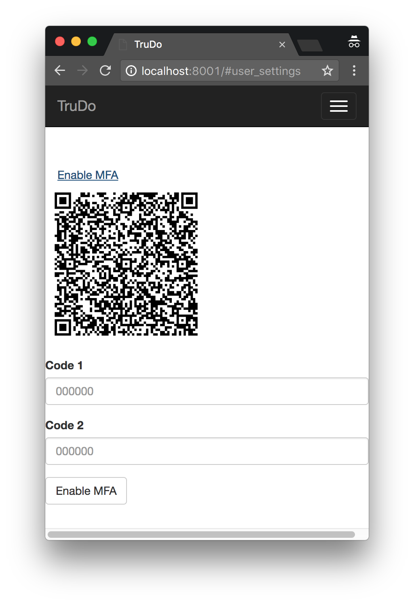

## Configuring TV Account

  1. Add account ID to `tv_config.js`.
  1. Create a new vault and update `tv_config.js`.
  1. Create a new group that grants `CRUD` on `Vault::<created vault id>::Document::$[Owner=self]` and `U` on `User::$[id=self.id]` and update `tv_config.js`.  We'll call this the "todo user" group.
  1. Create a new group (we'll call it "todo user signup") that grants `C` on `User::` and `C` on `Group::<todo user group id>::GroupMembership::.*`.
  1. Create a new user, and associate it with the "todo user signup" group.
  1. Generate a new API key for that user, update `tv_config.js`.

## User-facing Flow

|||
|----|----|
||First, users need to enroll in MFA. Your application will need to present the QR code returned by TrueVault, and collect an MFA code to finalize enrollment.|
||If all of your users have MFA enabled (e. g. because you force enablement during your registration flow), you can prompt for the MFA code directly on your login screen. Otherwise, you'll need to request just a username/password as normal, and check for the `USER.MFA_CODE_REQUIRED` error code.|
||If the login endpoint returns `USER.MFA_CODE_REQUIRED`, you'll need to request an MFA code in addition to the username/password.|
||Provide users a way to deactivate MFA, so that they're not locked out of their accounts when they change MFA devices. The UI needs to collect their password and the current MFA code.|
